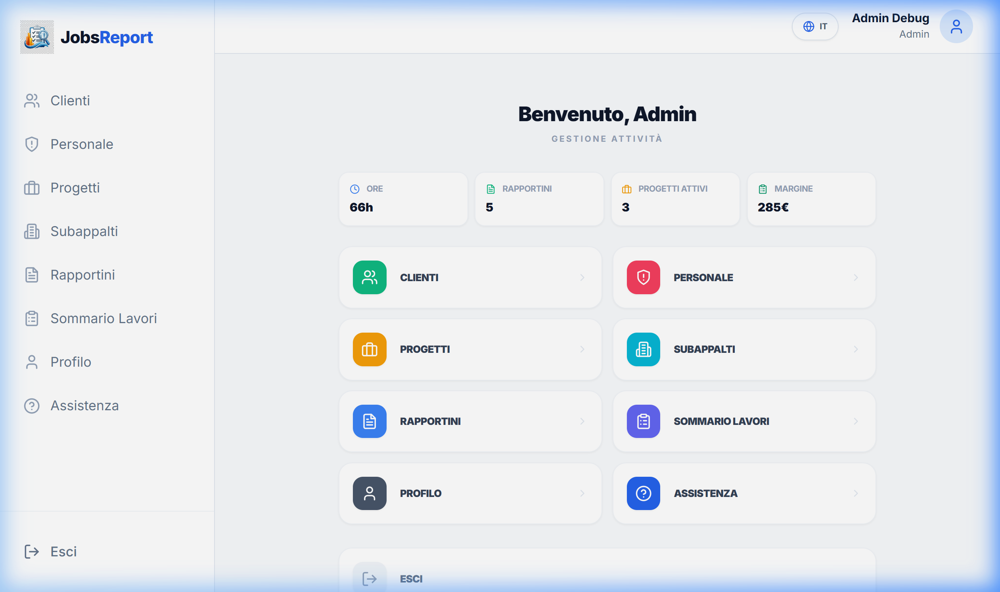
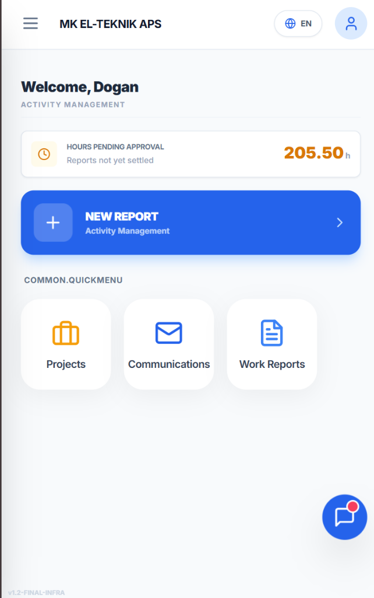
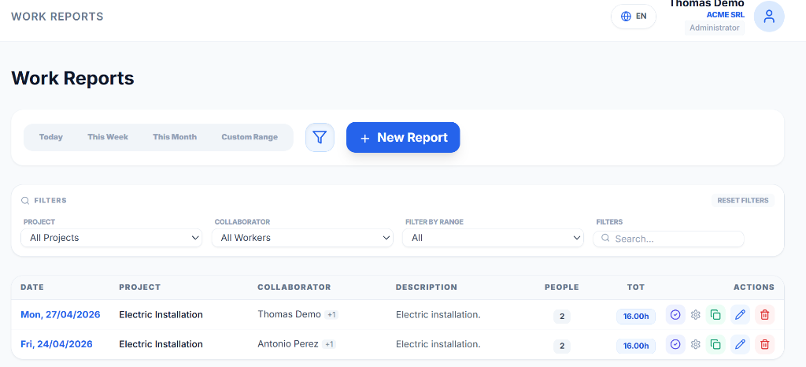
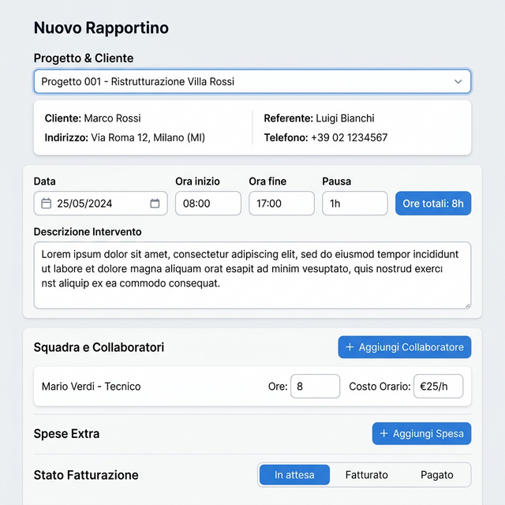
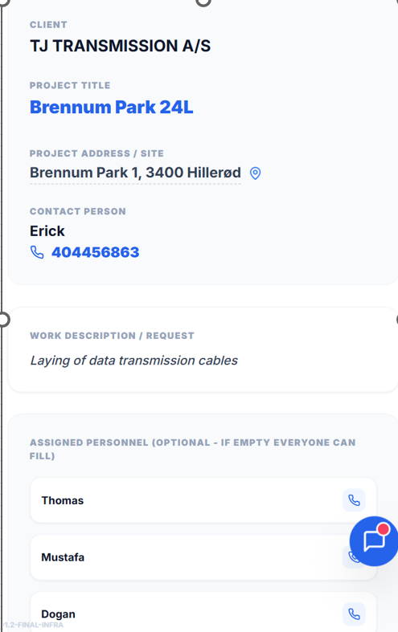
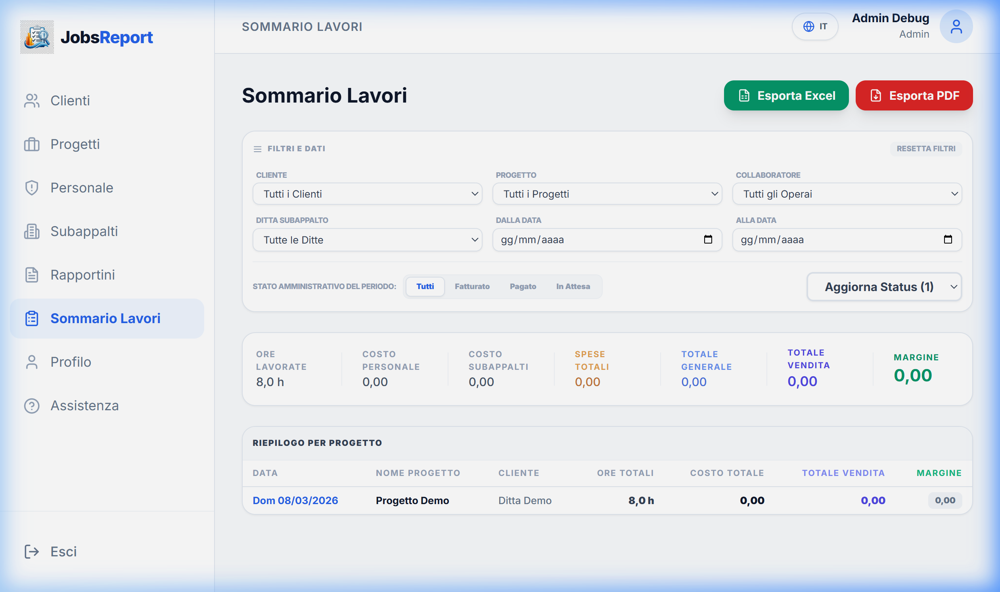

# Manuale d'Uso - Jobs Report

## Introduzione
Jobs Report è un'applicazione PWA progettata per la gestione e il monitoraggio dei lavori di cantiere, dei costi del personale e dei rapporti con i subappaltatori.

## 1. Accesso e Autenticazione

### Login
Accedi con le tue credenziali (username e password). L'applicazione supporta diversi livelli di accesso a seconda del ruolo assegnato:
- **Operatore**
- **Incaricato (Supervisor)**
- **Amministratore**

*Pagina di accesso — Inserisci le tue credenziali per iniziare*

### Recupero Password
In caso di smarrimento della password, contatta l'amministratore del sistema.

---

## 2. Dashboard Principale (Launcher)

Dopo il login, verrai indirizzato alla Dashboard principale. Da qui puoi accedere rapidamente a tutte le funzionalità autorizzate per il tuo ruolo.

Per gli **Operatori** e gli **Incaricati**, in questa pagina è ora visibile anche il **Riepilogo Ore del Mese** corrente, per avere sempre sott'occhio il proprio monte ore lavorate.

*Dashboard operaio — Ore in attesa di approvazione, accesso rapido a Progetti, Comunicazioni e Rapportini*

---

## 3. Gestione Rapportini

### Lista Rapportini
Visualizza tutti i rapportini caricati. Puoi filtrare per data o per progetto.
- **Operatori**: Vedono solo i propri rapportini.
- **Incaricati**: Vedono i propri e quelli dei collaboratori assegnati ai propri progetti.
- **Admin**: Vedono tutti i rapportini dell'azienda.

*Lista rapportini con filtri attivi — progetto, collaboratore, intervallo date*

### Creazione/Modifica Rapportino
Clicca su "**Nuovo Rapportino**" (o l'icona della matita per modificare):
- Seleziona il **Progetto**.
- Inserisci la **Data**.
- Specifica la **Squadra**: puoi aggiungere collaboratori cliccando su "Aggiungi Collaboratore".
- Inserisci le **Spese**: materiali, pasti, trasporti, ecc.
- Definisci lo **Stato Fatturazione** (solo per Admin).

*Form rapportino — orari, squadra, spese e stato fatturazione in un'unica schermata*

Permette l'inserimento e la modifica dei lavori svolti.
- **Operatori**: Possono gestire solo i propri dati.
- **Incaricati**: Possono gestire i dati propri e quelli dei **collaboratori** per i progetti a loro assegnati.
- **Admin**: Controllo completo su ogni aspetto del sistema.

### Dati principali

| Campo | Note |
| :--- | :--- |
| **Orario Inizio/Fine** | Calcolo automatico delle ore totali. |
| **Pausa** | Ore di pausa da detrarre dal totale. |
| **Straordinari** | Vengono calcolati oltre la soglia standard definita nel profilo. |

---

## 4. Gestione Progetti

### Dettaglio Progetto (Vista Operaio)
Ogni progetto mostra tutte le informazioni operative rilevanti direttamente dalla scheda:
- **Indirizzo cantiere** con collegamento diretto a **Google Maps** per la navigazione.
- **Contatto di riferimento** con numero di telefono **cliccabile** per chiamare direttamente.
- **Descrizione del lavoro** e **personale assegnato**, ognuno con pulsante di chiamata rapida.

*Scheda progetto — indirizzo con mappa, telefono diretto e personale assegnato*

### Progetti e Clienti (Solo Admin)
L'amministratore può creare nuovi progetti, associarli a un cliente e assegnare i lavoratori o gli incaricati.
- **Progetti Attivi**: Visibili per l'inserimento ore.
- **Progetti Chiusi**: Archivio storico, non più selezionabili per nuovi rapportini.

---

## 5. Sommario Lavori (Solo Admin)

Visualizzazione analitica dei costi e ricavi. Riservato agli **Admin**, permette di monitorare ore, costi (personale, subappalti, spese) e ricavi, con calcolo automatico del margine.

*Analisi economica per progetto e cliente*

---

## 6. Profilo e Impostazioni

### Profilo Utente
Ogni utente può aggiornare i propri dati di contatto e visualizzare il riepilogo delle proprie ore mensili.

### Lingua
L'applicazione supporta Italiano, Inglese, Spagnolo, Polacco, Turco e Danese. Cambia la lingua dall'icona del mondo nella testata.

---

## 7. Modalità PWA (Installazione)
Si consiglia di installare l'app sulla home del telefono o del PC tramite il tasto "**Installa App**" per un'esperienza più fluida e accesso offline.

---
*Jobs Report — Efficienza in cantiere, controllo in ufficio.*
