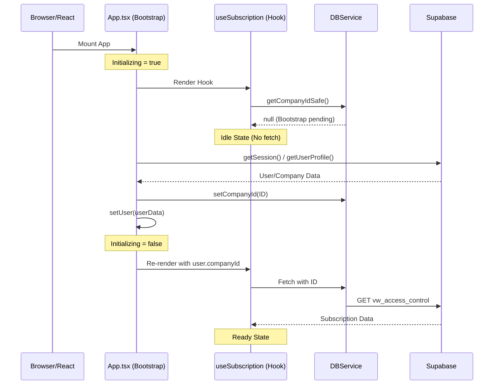

# Multi-Tenant Startup Initialization Architecture

## Root Cause Analysis
The startup crashes were caused by a **Timing & Dependency Race Condition**:

1. **Strict Multi-Tenancy:** The `DBService.requireCompanyId()` method is designed to fail hard if no tenant context is set. This is a secure "failing closed" pattern.
2. **Immediate Effect Execution:** React components and hooks (like `useSubscription`) initiate data fetches immediately upon mounting.
3. **Async Auth Bootstrap:** Authenticating with Supabase and fetching the user's company profile is an asynchronous process that completes *after* the initial component renders.
4. **The Collision:** During the first few milliseconds of app life, `useSubscription` was calling a strict DB method before the Auth Bootstrap had "hydrated" the company context, triggering the intentionally blocked action error.

---

## Recommended Flow Diagram



---

## Core Principles for SaaS Multi-Tenancy

### 1. Graceful Idle States
Hooks that depend on a tenant context should never throw during the "Bootstrap" phase. They should stay in a `loading: true` or `status: null` state until the dependency is satisfied.

### 2. Reactive Hook Dependencies
Pass the `companyId` (or the `user` object) directly as a dependency to your hooks. This ensures that:
- The hook doesn't run too early.
- The hook re-runs automatically if the user switches companies.

### 3. Safe vs. Strict Access
Use "Safe" getters for initialization and "Strict" getters for action execution (like Saving/Deleting).

| Method | Usage | Behavior |
| :--- | :--- | :--- |
| `getCompanyIdSafe()` | Hooks, UI logic, Initialization | Returns `null` if not set. |
| `requireCompanyId()` | Write operations, Sensitive fetches | Throws Error if not set. |

---

## Applied Patterns

### Hardened Hook Implementation (`useSubscription.ts`)
```typescript
export const useSubscription = (manualCompanyId?: string) => {
  // ...
  const refreshStatus = useCallback(async () => {
    // 1. Get company context safely
    const companyId = manualCompanyId || db.getCompanyIdSafe();
    
    // 2. Guard against premature fetches
    if (!companyId) {
      setLoading(false);
      setStatus(null);
      return;
    }

    setLoading(true);
    // ... continue fetch ...
  }, [manualCompanyId]);
  
  // 3. React to dependency changes
  useEffect(() => {
    refreshStatus();
  }, [refreshStatus, manualCompanyId]);
};
```

### Top-Level Guard (`App.tsx`)
```typescript
const App = () => {
  const [initializing, setInitializing] = useState(true);
  
  // Hook is reactive to the user state
  const { hasFeature } = useSubscription(user?.companyId);

  if (initializing) {
    return <LoadingSpinner />; // Full app loading gate
  }

  return <MainLayout />;
};
```

## Anti-Patterns to Avoid
- ❌ **Removing `requireCompanyId()`:** This degrades the security of the multi-tenant architecture.
- ❌ **Window-level state:** Avoid relying on `window.companyId` as it's not reactive and leads to stale state.
- ❌ **Suppressed errors:** Do not wrap strict fetches in empty `try/catch` blocks just to hide console noise; solve the timing instead.
